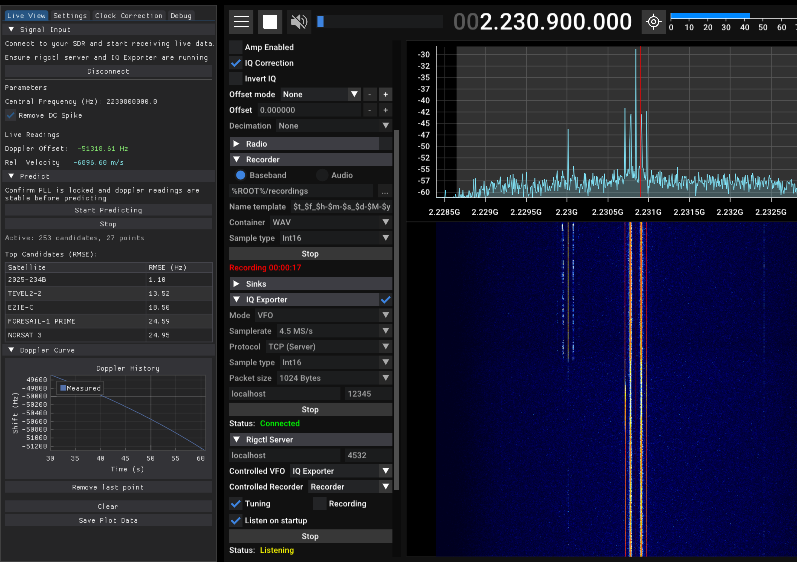

# Dopplerguesser
**An application that determines what satellite you are receiving based on the doppler signature of its signal.**

It is designed to work in conjunction with [SDR++](https://github.com/AlexandreRouma/SDRPlusPlus), a cross-platform and open source SDR software. 
> Note: If you are using MacOS, the IQ exporter module vital for this application to work is missing from the official builds. Build from source or download SDR++ from my [fork](https://github.com/BUSH222/SDRPlusPlus) instead.

## Table of Contents

## Installation
>The application has been tested exclusively on MacOS, so issues may appear when using this on Linux, and especially Windows. Please report them in issues

### Prerequisites
- [Python 3.13+](https://www.python.org/downloads/)
- GNURadio installed from [radioconda](https://github.com/radioconda/radioconda-installer) (Planned to be phased out from this project soon)

### Installation
1) Clone this repository:  
`git clone https://github.com/BUSH222/dopplerguesser`
2) Navigate to the project root using `cd /path/to/dopplerguesser` and create a virtual environment using `python3 -m venv venv` (or `python -m venv venv` on Windows)
3) Activate the venv using `source /venv/bin/activate` on MacOS/Linux (or `venv\Scripts\activate` on Windows)
4) Install the required packages: `pip install -r requirements.txt`
5) Start the application using `python3 main.py`

### Initial Configuration
1) Navigate to the settings tab in the application.
2) In the `Observer Location` tab, set your position (latitude, longitude, and altitude)
3) In the `Connections` tab, set the python path created by radioconda (likely different from python executing this application). On MacOS, the default is /Users/username/radioconda/bin/python. This path can be found when executing any GNURadio script from the companion.
4) Save the settings

### SDR++ Configuration
1) Enable the `iq_exporter` and `rigctl_server` modules in the module manager. If IQ Exporter is missing on MacOS, you will instead need to build sdr++ from source, or download it from my [fork](https://github.com/BUSH222/SDRPlusPlus).
2) Disable the `radio` module
3) Configure IQ Exporter: set mode to VFO, samplerate to 2-6 MS/s, Protocol to TCP (Server), sample type to Int16, Packet size to 1024, host to localhost, port to 12345. Start the IQ Exporter.
4) Configure Rigctl server: set host to localhost, port to 4532, controlled VFO to IQ Exporter, check tuning and listen on startup, and start.

## Usage
> This program should work at or below 2300MHz. It has been tested on S- and L- band satellite signals.

The program is tall and narrow on purpose to fit nicely along SDR++ in split view like this:

> Always update TLEs before use! TLEs are valid for a week at most, and their precision is constantly going down. The fresher the TLEs, the better the precision of the app.
1) Identify a continuous signal exhibiting doppler shift
2) Move IQ Exporter's VFO to roughly around the signal. 
> Tuning tip: Doppler shift from LEO satellites only makes the frequency only go down over time, so tune a bit lower than the frequency.
3) With IQ Exporter and Rigctl server running in SDR++, click `Connect` in the live view tab of the application. After ~5 seconds the frequency readings will start appearing in the Doppler History graph.
4) Wait for the PLL to lock onto the signal. The stronger and closer to 0 it is, the faster it will lock. The lock will be signified by a sharp peak (or drop) followed by a slowly descending plateau.
5) Once locked, clear the irrelevant pll locking data by pressing the clear button.
6) Click `Start Predicting` and after some time look at the table. It will show the top predicted candidates for the transmission. The longer you track the satellite, the bigger the confidence will be.
7) After the satellite signal gets too weak, click the `Disconnect` button and trim the last points using `remove last point` button if necessary. You can now judge whether the prediction was successful or not and save the plot data for further processing.

The data you saved can be processed manually and used in the `Processing` tab.

### Result interpretation
Look at the top candidates table. It shows the top 5 candidates and their RMSE (root mean squared error). It is a number that shows how much on average the predicted values differ from the observed values. The lower it is the better the match.

RMSE <= 50: Perfect match, the prediction is very likely correct
50 < RMSE <= 300: Good match, TLE may be slightly out of date. Check the epoch to confirm
RMSE > 300: Bad match, the prediction is wrong or you have not updated TLEs for a long time.

> When the program correctly predicted a satellite, the difference in RMSE between the first and second candidate is often very large, over 1000Hz for long passes.

## Algorithm

## License
[MIT License](LICENSE)

## Acknowledgements

## References
